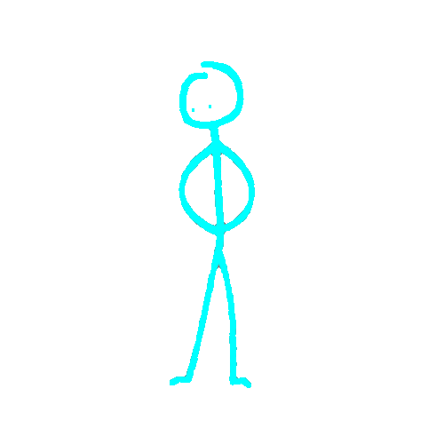
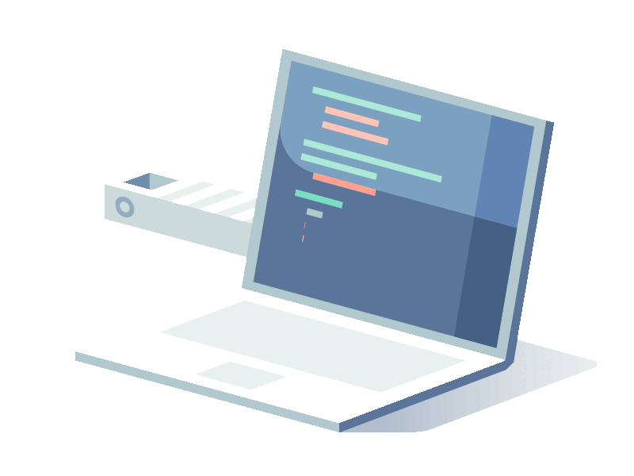

<p align="center">
  
</p>

<p align="center">
  
  
</p>


### 👨‍💻 About Me



I'm **Abdallah Mohamed Alhesh**, a passionate **Data Scientist & AI/ML Engineer** focused on building intelligent systems that transform data into real-world solutions.

My expertise lies in **Computer Vision, Deep Learning, and Natural Language Processing**, where I design and deploy AI solutions that bridge the gap between research and production.

I enjoy turning complex problems into scalable AI systems — from developing advanced models to building complete ML pipelines.

```yaml
name: Abdallah Mohamed Alhesh

location: Egypt

role:
  - Data Scientist
  - AI/ML Engineer

focus:
  - Computer Vision
  - Deep Learning
  - Natural Language Processing
  - Generative AI

specialties:
  - Computer Vision & Image Processing
  - Deep Learning Architectures (CNNs, Transformers)
  - NLP & Large Language Models (LLMs)
  - End-to-End Machine Learning Pipelines
  - Model Optimization & Deployment
  - AI System Design

currently_learning:
  - Multimodal AI Systems
  - MLOps & Model Serving at Scale
  - Generative AI & Diffusion Models
  - Advanced LLM Applications

philosophy:
  "Data is the foundation, but intelligence is the engine.
   I build AI systems that don't just predict — they understand."
```

<!-- ═══════════════════════════════════════════════════════════════ -->
<!--                    TECH STACK SECTION                           -->
<!-- ═══════════════════════════════════════════════════════════════ -->
<h2 align="center">
   Tech Stack
</h2>
<h4 align="center">💻 Languages</h4>
<p align="center">
  
  
  
  
  
  
</p>
<h4 align="center">🧠 AI / ML</h4>
<p align="center">
  
  
  
  
  
  
</p>
<h4 align="center">🗣️ Natural Language Processing</h4>
<p align="center">
  
  
  
  
  
  
</p>
<h4 align="center">👁️ Computer Vision</h4>
<p align="center">
  
  
  
  
  
  
</p>
<h4 align="center">📊 Data</h4>
<p align="center">
  
  
  
  
  
  
</p>
<h4 align="center">⚙️ Backend / Tools</h4>
<p align="center">
  
  
  
  
  
  
  
  
</p>
<h4 align="center">🗄️ Databases / Platforms</h4>
<p align="center">
  
  
  
  
  
  
  
</p>

<!-- ═══════════════════════════════════════════════════════════════ -->
<!--                    WHAT I BUILD SECTION                         -->
<!-- ═══════════════════════════════════════════════════════════════ -->
## What I Build
- Deep Learning Models — CNNs, Transformers, and custom architectures for vision and NLP
- Real-time AI systems with streaming APIs
- Computer Vision Systems — Object detection, segmentation, face recognition, video analysis
- NLP Apps — Sentiment analysis, NER, text classification, LLM-based tools
- ML Pipelines — End-to-end flows from data cleaning to deployment
- AI Products — Stuff that actually works in production, not just notebooks
<!-- ═══════════════════════════════════════════════════════════════ -->
<!--                   CURRENT FOCUS SECTION                         -->
<!-- ═══════════════════════════════════════════════════════════════ -->
## Current Focus
Right now I'm diving into:
- Multimodal AI (combining vision + language)
- MLOps and getting models to production properly
- Generative AI — diffusion models, GANs, and the whole generative space
- Contributing to open-source when I can
- Building AI tools that have real impact

## GitHub Activity
<div align="center">
  
</div>

<!-- ═══════════════════════════════════════════════════════════════ -->
<!--                ENGINEERING PRINCIPLES SECTION                   -->
<!-- ═══════════════════════════════════════════════════════════════ -->
## Engineering Principles
- Every model must solve a real problem
- Readable, maintainable ML pipelines
- Optimized models without sacrificing accuracy
- Build, test, learn, and improve continuously
- Clear communication of complex AI concepts
<!-- ═══════════════════════════════════════════════════════════════ -->
<!--                    CONNECT SECTION                              -->
<!-- ═══════════════════════════════════════════════════════════════ -->
<h2 align="center">
   Let's Connect
</h2>
<p align="center">
  <a href="https://www.linkedin.com/in/abdallah-mohamed-alhesh/" target="_blank">
    
  </a>
  <a href="mailto:abdallahmohamedalhesh@gmail.com" target="_blank">
    
  </a>
  <a href="https://github.com/AbdallahElesh22" target="_blank">
    
  </a>
</p>
<p align="center">
  
</p>
<!-- ═══════════════════════════════════════════════════════════════ -->
<!--                      FOOTER SECTION                             -->
<!-- ═══════════════════════════════════════════════════════════════ -->
<p align="center">
  
</p>
<p align="center">
  
</p>
<p align="center">
  <i>⭐ Star my repositories if you find them useful — it means a lot! ⭐</i>
</p>

